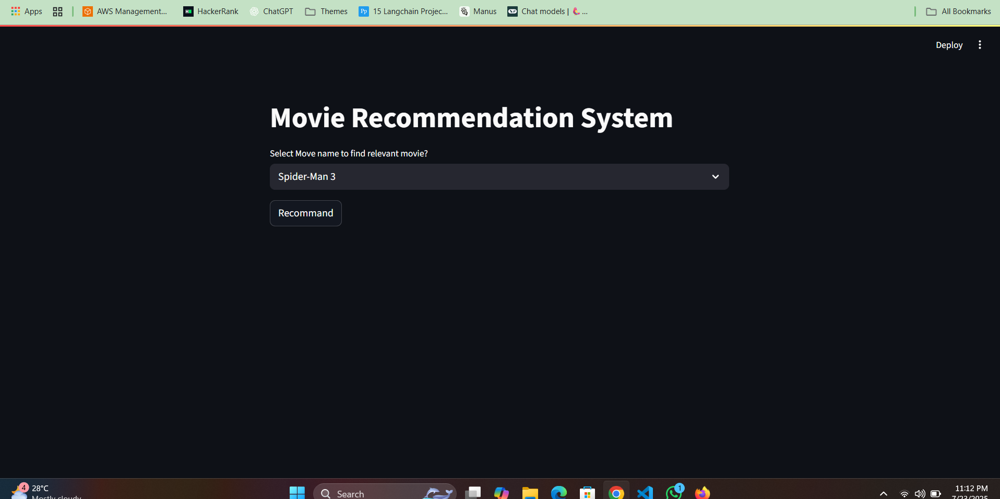

# 🎬 Movie Recommender System

A smart, AI-powered movie recommender system that suggests movies you'll love based on your preferences, past selections, or similar movie titles.

Built with:

- 🧠 Machine Learning / NLP
- 🧾 Movie metadata (TMDb / IMDB)
- 🖥️ Python + Streamlit (or Flask)
- 📊 Pandas, Scikit-learn, or Surprise

---

## 🖼️ UI Screenshot

 <!-- Replace with actual screenshot path -->

---

## 🔥 Features

- 🔍 Search for a movie and get similar recommendations
- ⭐ Personalized suggestions based on user history or ratings
- 🎭 Content-based filtering using genres, descriptions, keywords, etc.
- 👥 Collaborative filtering (if using user ratings)
- 🖥️ Simple, responsive web UI

---

## ⚙️ Installation

```bash
# Clone the repo
git clone https://github.com/OneSakib/movie-recommender-system.git
cd movie-recommender

# Create virtual environment
python -m venv venv
source venv/bin/activate  # Windows: venv\Scripts\activate

# Install dependencies
pip install -r requirements.txt

# Run the app (Streamlit example)
streamlit run app.py
```
